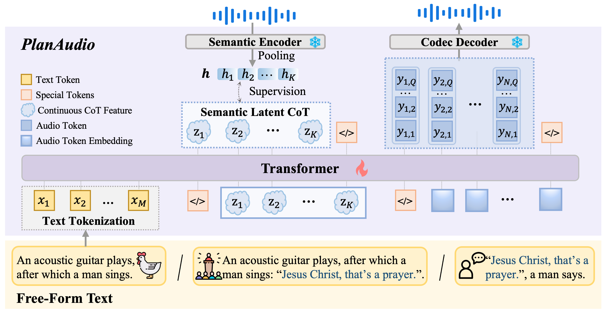

## PlanAudio

Audio generation has made significant progress, yet synthesizing unified audio where speech and sounds are naturally composited remains a challenge. Current methods either rely on disjoint pipelines, which fail to capture fine-grained interactions, or require structured inputs and external text rewriting, which limits the flexibility of free-form text prompts. In this paper, we introduce a new task: Free-Form-Text-Prompt-to-Unified-Audio generation, which aims to directly synthesize unified audio containing speech, sound, and their composites from unconstrained natural language. To address this task, we propose PlanAudio, a unified, autoregressive LLM-based framework. First, it simplifies the model architecture by leveraging intrinsic LLM reasoning capability instead of traditional text encoders. Second, it introduces a semantic latent chain-of-thought mechanism, an implicit planning mechanism that bridges high-level semantic understanding and low-level acoustic synthesis. Furthermore, we create PlanAudio-Bench, a specialized benchmark for evaluating composite audio scenarios. We perform evaluations in the scenarios of speech, sound, and their composites. The results demonstrate that PlanAudio generally outperforms the existing pipeline and unified baselines, while staying competitive with models designed for a single scenario. Our analysis further reveals the superiority of semantic latent CoT over other CoT mechanisms and highlights the importance of continuous multi-scenario training curricula.

[Demos](https://anonymous.4open.science/w/PlanAudio2026-029E/)

<!-- ## Code coming soon -->
## 🚀 Code & Assets Release Plan

All resources for this project are ready and will be fully open-sourced upon the official acceptance of our paper. 

| Asset | Description |
| :--- | :--- |
|PlanAudio-Bench|✅|
|Evaluation Scripts|✅|
|Audio Outputs |https://drive.google.com/file/d/1lTbNLt4ScXU7ugj7779wGwg9ENziorVm/view?usp=drive_link ✅|
| 💻 Core Codebase | Model architecture and training modules |
| 📜 Scripts | Complete training and inference pipelines |
| 📦 Checkpoints | Pre-trained model weights for PlanAudio |
| 📊 Dataset | New training data for composite scenario and PlanAudio-Bench evaluation suite |